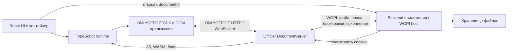

# План officier-react: React UI, движок с DocumentServer, WOPI

Дата исследования: 2026-09-09. Статус: Stage 0 готов; Stage 1 начат с typed manifest loader и React lifecycle.

## Цель и принятые решения

Редактор DOCX работает в DOM приложения: React управляет панелями и контейнером,
ONLYOFFICE SDK рисует документ в canvas внутри этого контейнера. SDK, шрифты,
WASM и прочие собранные ресурсы браузер получает с Officier DocumentServer.
WOPI связывает DocumentServer с backend приложения, который хранит документы.
Совместное редактирование браузера с DocumentServer сохраняет протокол ONLYOFFICE.

Первый результат: один DOCX-редактор на страницу, свой React toolbar,
открытие → правка → сохранение через WOPI → повторное открытие.
TypeScript strict для нового кода; pnpm для разработки, CI и публикации.
Установка пакета в приложениях через pnpm и Bun проверяется отдельно.
Команды npm, npx и yarn не используются.

Это расширение нашего Officier, а не обещание совместимости без iframe с любым
штатным ONLYOFFICE DocumentServer. Текущий контейнер Officier 0.1.0 ещё не содержит
описанных ниже manifest/bootstrap endpoint и адаптера. Его проверка DOCX через
Docs API не доказывает готовность нового пути WOPI.

## Что показало исследование

1. [Официальный React-компонент](https://api.onlyoffice.com/docs/docs-api/get-started/frontend-frameworks/react/)
   загружает Docs API и предоставляет React lifecycle, props и события.
   [Его исходник](https://raw.githubusercontent.com/ONLYOFFICE/document-editor-react/master/src/DocumentEditor.tsx)
   вызывает `window.DocsAPI.DocEditor`. В закреплённом `web-apps` функция
   `createIframe` в `apps/api/documents/api.js:1279` создаёт iframe.
   Готового переключателя для прямого DOM-монтажа этот путь не даёт.
2. [Стандартная WOPI host page](https://api.onlyoffice.com/docs/docs-api/using-wopi/host-page/)
   отправляет форму с токеном в iframe и общается с ним через PostMessage.
   Поэтому WOPI сам по себе не убирает iframe. Наш прямой запуск будет расширением
   Officier; серверные операции с WOPI host остаются стандартными.
3. В `server/DocService/sources/wopiClient.js`, `getEditorHtml`, уже есть
   CheckFileInfo, определение прав, подготовка документа/блокировки и подпись
   параметров перед `res.render('editor-wopi', params)`. Это точка извлечения общей
   функции подготовки сессии для HTML и нового JSON endpoint.
4. В `web-apps/apps/documenteditor/main/app.js` перечислены зависимости SDK и пути
   ресурсов. В `main/app/controller/Main.js` есть заполнение DocInfo,
   `asc_setDocInfo`, запуск загрузки и обработка событий. Переиспользуем нужную
   последовательность, отделив её от Backbone/RequireJS UI и Gateway.
5. `sdkjs/word/api.js` использует `window.editor`, а `word/Drawing/HtmlPage.js` —
   фиксированные ID и `document.getElementById`. Shadow DOM этого не исправляет.
   Для начала используем обычный DOM и один экземпляр; второй mount возвращает
   типизированную ошибку. Локализуем поиск элементов и управление событиями
   точечными патчами, без глобальной подмены методов document.
6. `sdkjs/common/clipboard_base.js:894` создаёт скрытый iframe для HTML paste.
   Требование принимаем буквально: runtime не должен создавать и скрытые iframe.
   Plain-text paste входит в первый срез; rich paste требует отдельного адаптера.
   Печать и плагины также проверяются на iframe до включения в поддерживаемые функции.

Проверенные локальные версии: sdkjs `72b0421c0bbf9d01eed9cf14834ae47eb2df1b50`,
web-apps `9c0ca538c3b211052347df09d2a4d6781f023403`,
server `d6df308acb9877a9365c741b30741de96202816e` с текущими патчами Officier.

## Что переиспользуем

| Часть | Решение |
| --- | --- |
| Разметка страниц, модель документа, canvas, undo/redo | ONLYOFFICE sdkjs |
| Конвертация DOCX и совместное редактирование | Существующий DocumentServer |
| WOPI client, операции файлов и блокировок | Существующая серверная реализация |
| Панель и bridge команд | Развиваем текущий `createWordController` и `OfficierToolbar` |
| Типы публичного Docs API | Берём подходящие типы `@onlyoffice/doceditor-types`; они не типизируют внутренний SDK |
| Загрузка и запуск SDK, React lifecycle, прямые события | Новый узкий адаптер Officier |
| UI команд | Собственные React-компоненты; React не перерисовывает DOM, которым владеет SDK |

Не переносим весь интерфейс ONLYOFFICE в React и не переписываем движок.
Не загружаем серверный HTML через innerHTML и не исполняем извлечённые из него scripts.
Под «исходниками с сервера» здесь понимаются готовые браузерные ресурсы; исходники
для сборки остаются в закреплённых репозиториях и патчах.

## Архитектура и поток открытия



1. React запрашивает сессию у backend приложения по `documentId`.
2. Backend проверяет пользователя и создаёт WOPI grant на нужный файл.
3. Backend вызывает новый Officier bootstrap. Тот переиспользует существующую
   подготовку WOPI-сессии, проверяет права и возвращает данные для runtime.
4. Runtime получает manifest с версиями, загружает ресурсы в нужном порядке,
   создаёт SDK в контейнере и применяет подготовленную конфигурацию.
5. SDK подключается к DocumentServer; DocumentServer получает файл через WOPI
   и выполняет существующий цикл конвертации/редактирования/сохранения.
6. React получает прямые типизированные события runtime. Отправка команды Save
   и подтверждение записи файла в WOPI host — разные состояния.

Предлагаемые новые маршруты, пока отсутствующие:

- `GET /officier/runtime/manifest.json`: версия протокола адаптера, build ID
  сервера/SDK, список ресурсов с URL, порядком загрузки и хешами, capabilities.
- `POST /officier/sessions/wopi`: общая подготовка WOPI-сессии с JSON-ответом.
  Поля и формат browser token закрепить после проверки `editor-wopi` и DocInfo.
- В backend приложения — собственный endpoint открытия по documentId;
  raw WOPISrc не должен превращать сервер в произвольный HTTP proxy.

Предпочтительная схема развёртывания — same-origin reverse proxy: `/officier/`
для ассетов и HTTP/WebSocket на DocumentServer, `/api/` для backend приложения.
Проверить префиксы, абсолютные URL, forwarded headers и WebSocket upgrade.
Cross-origin поддержку добавлять после отдельной проверки CORS, CSP, fonts,
workers и WASM. Proxy устраняет часть проблем origin, но не выполняет DOM-монтаж.

Signing secrets и WOPI proof private key остаются на backend/DocumentServer.
Браузер получает только необходимые краткоживущие данные сессии; учитывать, что
подписанный JWT читается клиентом и не шифрует вложенные данные. Токены не помещать
в manifest, логи и долговечное клиентское хранилище. Новый bootstrap авторизовать,
ограничить доверенные WOPI hosts и переиспользовать серверную проверку адресов.

## Этапы и критерии завершения

### 0. Подготовка TypeScript и инструментов

- Перенести `src/*.js` в `.ts/.tsx`; генерировать `.d.ts` из исходников.
- ESM output, React в peerDependencies, отдельные exports для UI и runtime.
- Выбрать и закрепить точную совместимую версию pnpm; использовать версию с
  нативным publish, без вызова npm CLI. По [документации pnpm](https://pnpm.io/cli/publish)
  это поддерживается начиная с v11. Проверить требования выбранной версии к Node.
- Заменить package-lock на pnpm-lock, обновить scripts, README и workflow публикации.
  Устанавливать pnpm через официальный setup action/standalone способ без npm.
- CI: frozen lockfile, typecheck, тесты, сборка и проверка tarball.
  Bun проверять в отдельном consumer fixture, не вести два lockfile одного workspace.
- Проверять отсутствие npm/npx/yarn в исполняемых scripts и workflow, включая
  используемые нами этапы сборки runtime в серверном репозитории.

Готово Stage 0: текущая панель и controller проходят прежние тесты; декларации
генерируются из TypeScript; пакет устанавливается в TypeScript-приложения через
pnpm и Bun.

### 1. Проверка прямого монтажа — главный технический рубеж

- Составить точный список ассетов из работающей сборки; создать versioned manifest.
  Клиентский контракт `runtime/manifest.json`, loader и серверный endpoint
  `/officier/runtime/manifest.json` уже добавлены. Список assets пока пустой,
  потому что direct SDK adapter ещё не собран.
- Запустить SDK в обычном div тестового React + TypeScript приложения.
  React lifecycle `<OfficierEditor>` уже добавлен; прямой SDK adapter ещё нужен.
- Вынести минимальный запуск из Main.js, подать тестовую конфигурацию документа.
- Проверить canvas, текстовый ввод/IME, выделение, фокус toolbar, resize и undo/redo.
- Найти и устранить необходимые зависимости от parent window, Gateway,
  глобальных обработчиков и URL исходной editor page.
- Проверить размонтирование, повторный монтаж, отмену загрузки и React StrictMode.
  Удаление script-тега не считается выгрузкой выполненного SDK.
- Зафиксировать, какие ресурсы upstream пригодны без изменения, а какие требуется
  собирать с патчами. Для изменённого SDK добавить воспроизводимую сборку в Officier;
  подмена только server JS в нынешнем Dockerfile этого не обеспечивает.

Готово: реальный DOCX виден и редактируется в DOM приложения без iframe.
Если запуск требует более глубоких патчей, документировать конкретные зависимости
и пересмотреть оценку перед расширением UI. Не подменять результат iframe-обёрткой.

### 2. Полный путь WOPI

- Извлечь общую функцию подготовки сессии из getEditorHtml и добавить JSON endpoint.
  Штатный HTML endpoint использует ту же функцию, чтобы не дублировать WOPI-логику.
- Сопоставить результат подготовки с конфигурацией прямого SDK; проверить
  идентичность документа/tenant, view/edit, lock failure, токен и срок действия.
- Создать демонстрационный WOPI host: CheckFileInfo, GetFile, PutFile, Lock,
  RefreshLock, Unlock, проверка access token и WOPI proof по настройкам интеграции.
  [Список операций ONLYOFFICE](https://api.onlyoffice.com/docs/docs-api/using-wopi/wopi-rest-api/).
- Проверить запись файла, обновление его версии, конфликт блокировки и expiry.
- Определить источник подтверждения persisted revision: подтверждённое серверное
  событие либо endpoint backend приложения. Не считать asc_Save подтверждением записи.

Готово: открыть DOCX, изменить текст, сохранить, дождаться записи в WOPI host,
закрыть сессию, открыть заново и увидеть изменения. Два пользователя в разных
браузерных контекстах редактируют один файл через существующий coauthoring сервер.

### 3. Публичный React API и собственный интерфейс

- `<OfficierEditor>`: loading/error/ready, ref API и renderer слоты для toolbar.
- `useOfficierEditor`/подписки состояния: ready, readOnly, selection, dirty,
  saving, saved, reconnecting и типизированные ошибки.
- Сохранить существующие команды controller; добавить проверенные команды
  размера шрифта, выравнивания и списков после базового среза.
- Поддержать React 18/19 и SSR-safe import: DOM/SDK только после client mount.
- ResizeObserver; toolbar сохраняет выделение, клавиатура и формы host продолжают работать.
- Один активный SDK на страницу; несколько toolbar могут обращаться к одному controller.

Готово: приложение использует typed props/hooks без обращения к `window.editor`;
React управляет UI, runtime — всеми побочными эффектами и SDK lifecycle.

### 4. Отсутствие iframe и устойчивость

- Playwright проверяет frameattached и создание iframe на всём сценарии, включая
  кратковременные/скрытые элементы; финального `querySelectorAll` недостаточно.
- Plain-text copy/paste и IME работают без legacy iframe. Для rich HTML paste
  исследовать безопасный разбор/очистку HTML и получение стилей в отдельном контейнере;
  не подставлять недоверенный HTML в DOM приложения без обработки.
- Функции, которым пока нужен iframe (rich paste, print, plugins), явно недоступны
  до адаптации; runtime не должен включать такой fallback незаметно.
- Проверки: 401/403, readonly, 409 lock conflict, потеря сети, expiry, несовместимые
  версии ассетов, повторные mounts, клавиатура host, Chromium/Firefox/WebKit.
- Закрытие с несохранёнными данными — явный lifecycle приложения. Cleanup не обещает
  завершить async save при уходе со страницы; сохранять нужно до размонтирования.

Готово: заявленные функции не создают iframe и не повреждают host UI; документы
после повторного открытия сохраняют текст и форматирование. Ошибки сохранения видимы.

### 5. Совместный alpha-релиз

- Выпустить согласованные версии контейнера, manifest/runtime и React-пакета.
- Закреплять образ digest/build ID, не рассчитывать на произвольный `latest`.
- Публиковать через pnpm в текущий GitHub Packages; включить JS, декларации, CSS,
  README и пример TypeScript-интеграции. Тяжёлые SDK/шрифты остаются на сервере.
- E2E запускается против итогового Docker image и упакованного React tarball.
- Показать сведения о происхождении движка и существующие notices в новом UI.
- Документировать точную матрицу возможностей и ограничение текущего Officier:
  in-memory состояние совместного редактирования не даёт восстановления активной
  сессии после рестарта, даже если уже сохранённый файл находится в WOPI storage.

Готово: пример устанавливается через pnpm/Bun, открывает и сохраняет DOCX через
WOPI в своём DOM. Выпуск остаётся alpha до проверки устойчивости и хранения сессий.

## Предлагаемый контракт (эскиз, пока отсутствует в пакете)

```tsx
import {OfficierEditor, type OfficierSession} from '@baken667/officier-react';

export function DocumentPage({session}: {session: OfficierSession}) {
  return (
    <OfficierEditor
      documentServerUrl="/officier/"
      session={session}
      onReady={(editor) => editor.focus()}
      onError={(error) => console.error(error.code)}
    />
  );
}
```

`session` выдаёт backend после авторизации; в нём версия протокола/сборки,
ограниченные данные открытия, фактические права и срок действия. Его точную схему
и модель подтверждённого сохранения закрепляем на этапе 2, а не угадываем по Docs API.

## За пределами первого результата

XLSX/PPTX/PDF, несколько SDK в одном window, полный ribbon ONLYOFFICE,
произвольные плагины, все браузеры/мобильные устройства и совместимость с любой
версией DocumentServer требуют отдельных адаптеров и проверок. Оценку сроков
полного продукта делать после этапов 1–2: сейчас это основные неизвестные.
